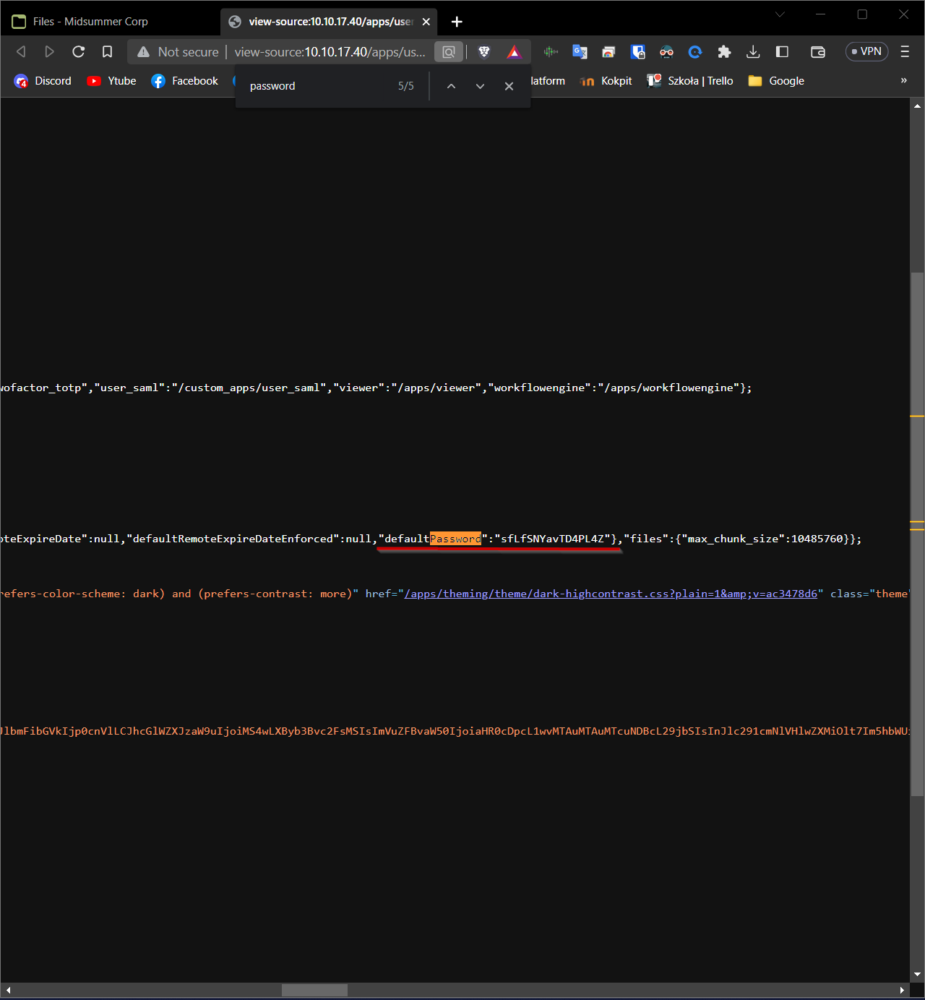

# Task 3
We must open source of the main site and then we must search for default password which is Puck password.

To find information about email, we must turn on hidden files visibility. Then we can find ".mail" folder, where is "inbox.mbox" file. There is wanted mail.
