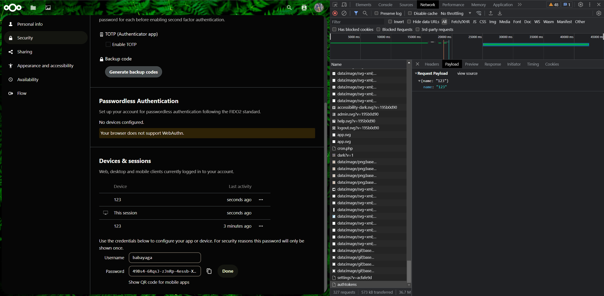
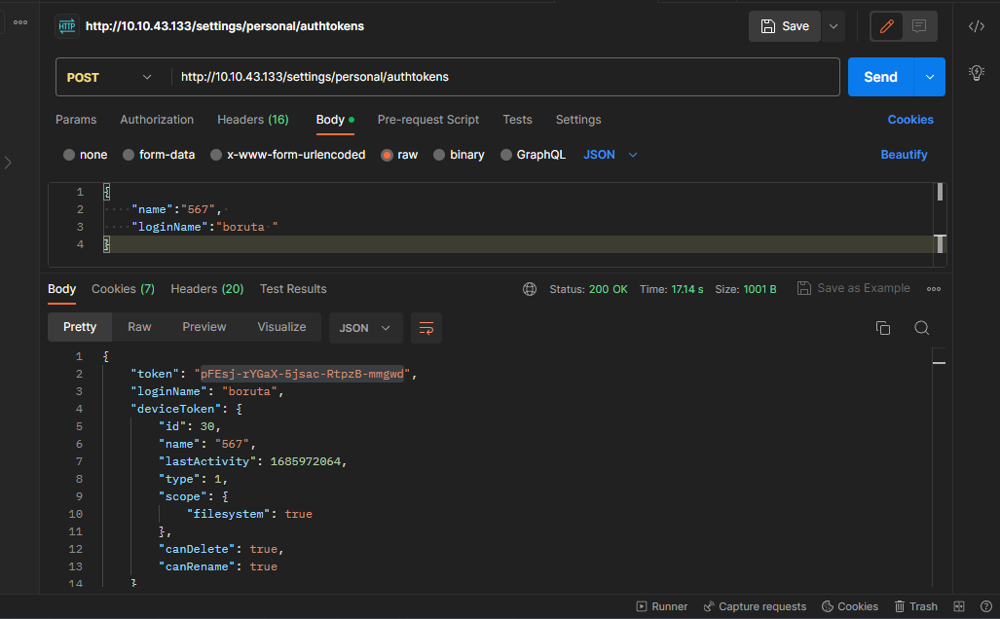
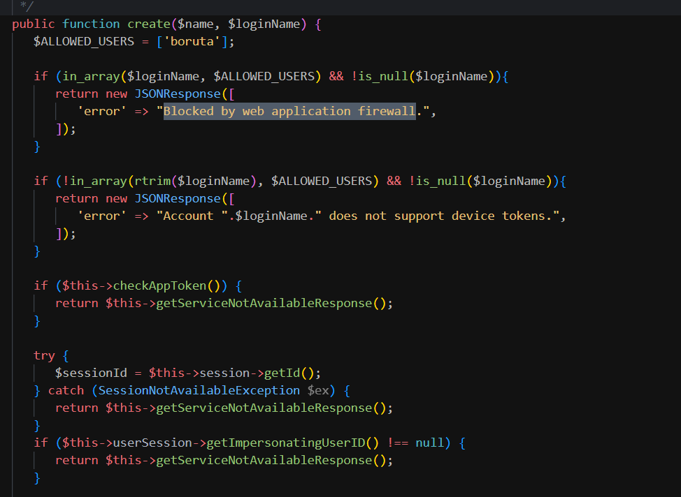

# Task 6
We must go to the settings. Next we must add Password App and view payload of request.

Next configure postman extension and application.

Send request with properly chosen loginName. Which will avoid protections.

 
 
