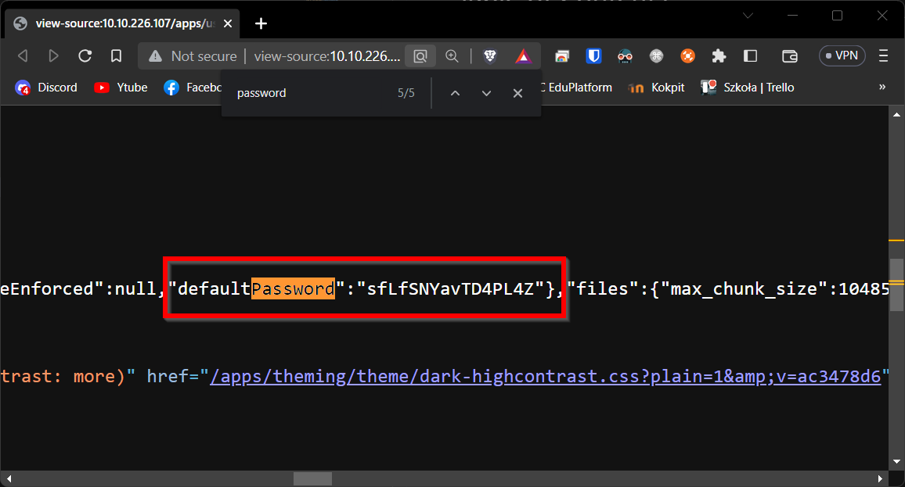
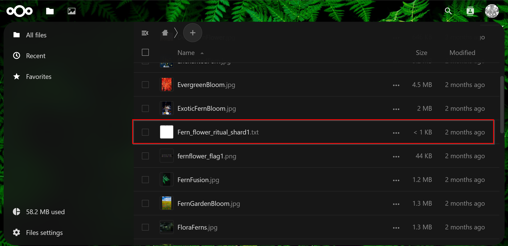
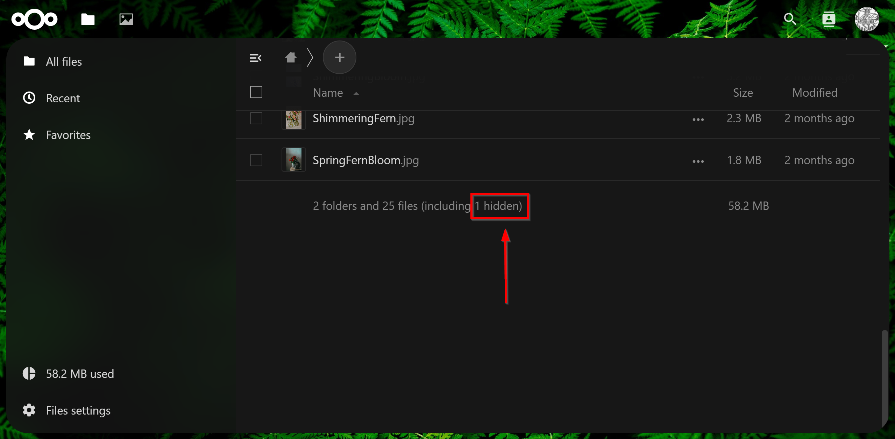
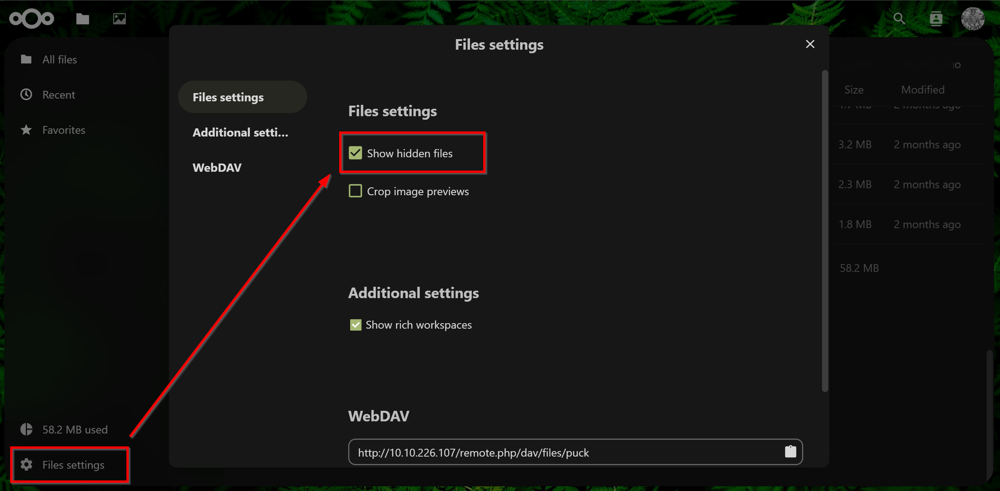
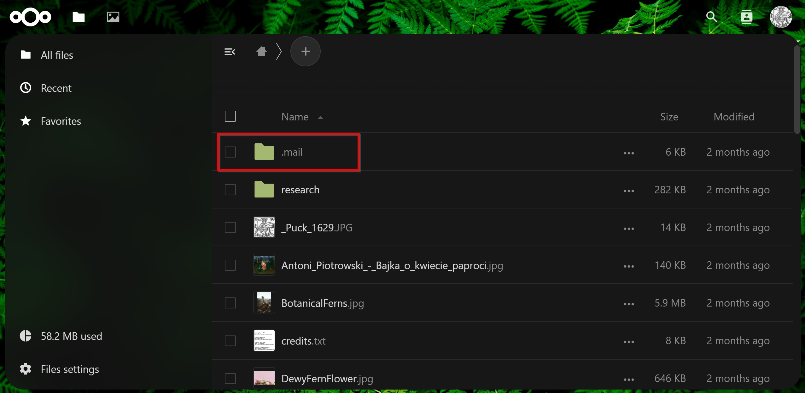
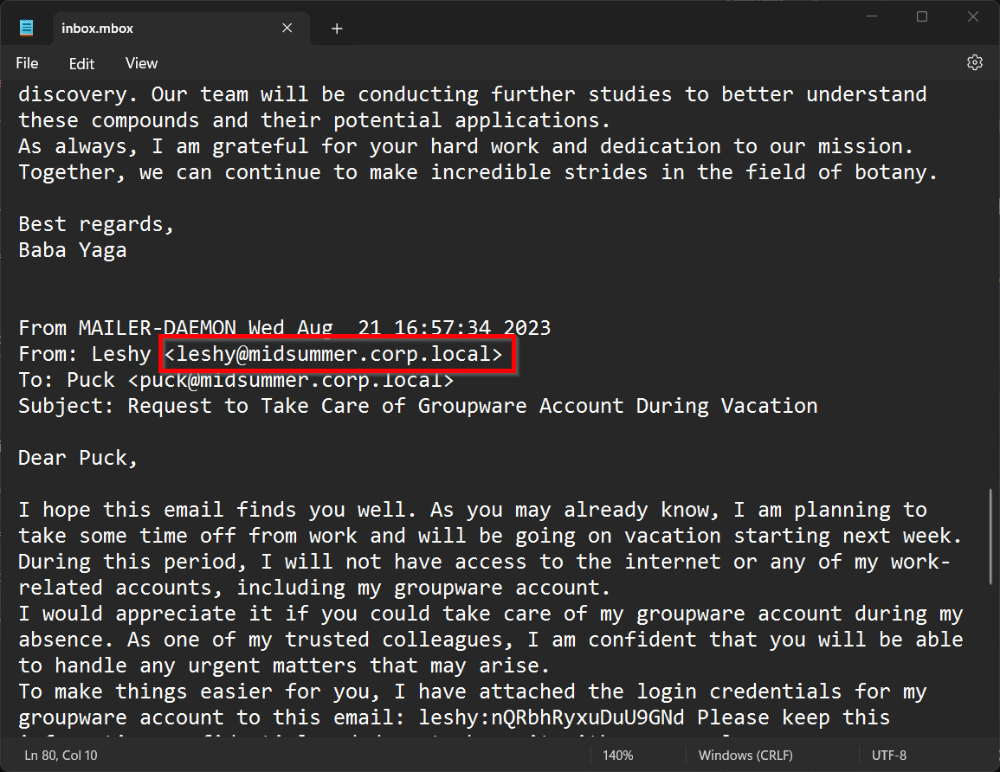

# Task 3 Puck

## 1. What do we call the process of verifying the identity of a user or system?

Answer: `Authentication`

<br>

We can find it in description: 

```
Authentication is the process of verifying the identity of a user or a system
```

<br>
<br>

## 2. How do we call the process of verifying that a user has access to a particular resource?

Answer: `Authorization`

<br>

I know that actually, but you can also search it on google.

<br>
<br>

## 3. How long is Puck's password?

Answer: `16`

<br>

We must open source of the main site and then we must search for default password which is Puck password.



<br>
<br>

## 4. What is the content of the file Fern_flower_ritual_shard1.txt in Puck's account?

Answer: `Midsummer_Corp{W@it_unt!1_m1dn1ght_0n_th3_Summ3r_Solst1c3}`

<br>

File is here.




## 5. Who is going on vacation? Please provide their email address.
Answer: `leshy@midsummer.corp.local`

<br>

To find information about email, we must turn on hidden files visibility.



We must open settings.



Then we can find ".mail" folder, where is "inbox.mbox" file.



There is wanted mail.

