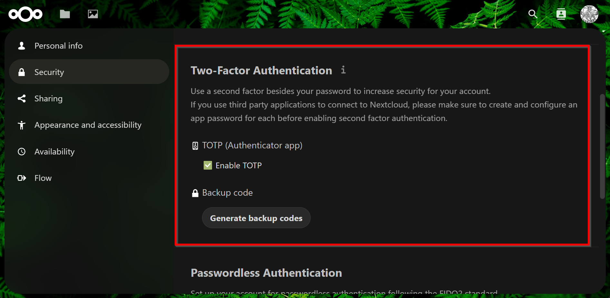
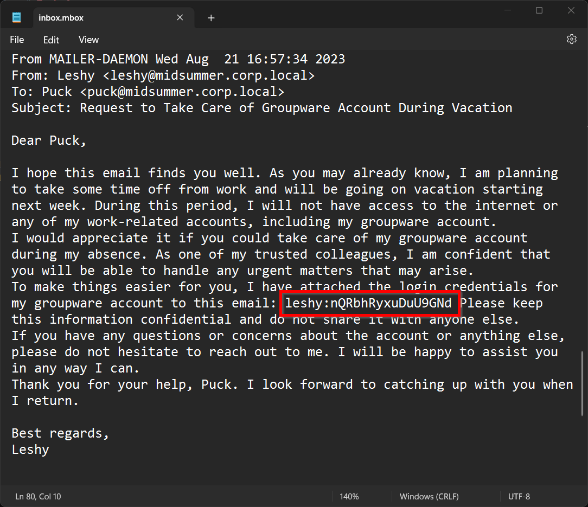

# Task 4 Leshy

## 1. What is the length of the MFA code used in the application? Enter a numeric value in your answer.

Answer: `6`

 

Solution

To activate 2-factor authentication we must activate in Puck settings. Unfortunately that 2-factor authentication is also valid for Leshy account.

The answer is length of the code in Authenticator app.

 

## 2. What is the content of the file Fern_flower_ritual_shard2.txt in Leshy's account?

Answer: `Midsummer_Corp{Fo11ow_Th3_Wi1l_o'_7h3_W1sps}`

 

Solution

Then we must go to Leshy account. This information is placed in `inbox.mbox` file.

And here we go. We have access to the Leshy account and to the file with flag.

