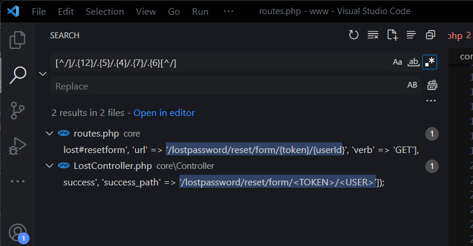

# Task 5 Baba Yaga

## 1. Which HTTP header was used to bypass throttling?

Answer: X-Forwarded-For

 

Solution

In description we have answer: `X-Forwarded-For: 127.0.0.1`

 
 

## 2. What is the endpoint path for resetting a password?

Answer: `/lostpassword/reset/form/<TOKEN>/<USER> `

 

Solution

We must download source zip file. Then let's use regex to search for the path.

 
 

## 3. What is the content of the Fern_flower_ritual_shard3.txt file in babayaga account?

Answer: `Midsummer_Corp{F1nd_th3_cl34r1ng_w1th_th3_anc13nt_st0n3s}`

 

Solution

To get into the Baba Yaga account, we must also set header which is "X-Forwarded-For". I used for that google extension Mod Header.

Then we must find `<user>` to the reset url.

Token can be whatever you want. When we open link, we will see the reset form.

And here we are. We have access to Babayaga account.

