# Task 6 Boruta

## 1. What parameter name assigns the app password to the specific user?

Answer: `loginName`

We must go to the settings. Next we must add Password App.

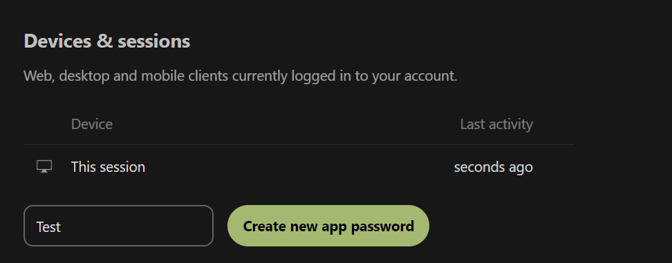

Now let's view payload of request.

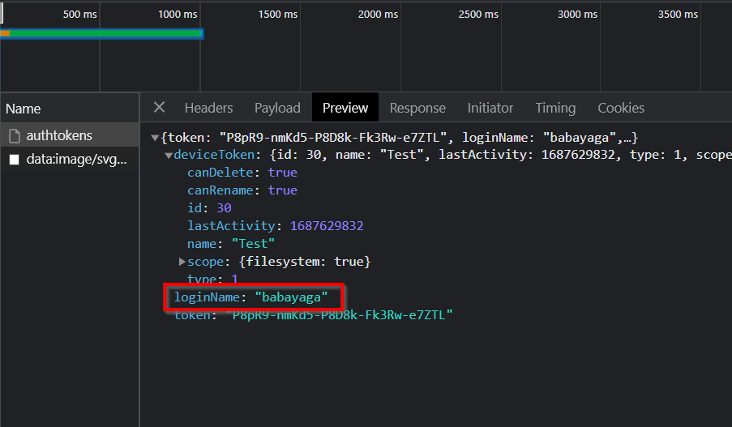

## 2. What is the content of the Fern_flower_ritual_shard4.txt file in Boruta's account?

Answer: Midsummer_Corp{L3ave_an_0ff3r1ng_f0r_th3_spir1ts}

  

Now we must use Postman extension to synchronize cookies and requests with Postman application.

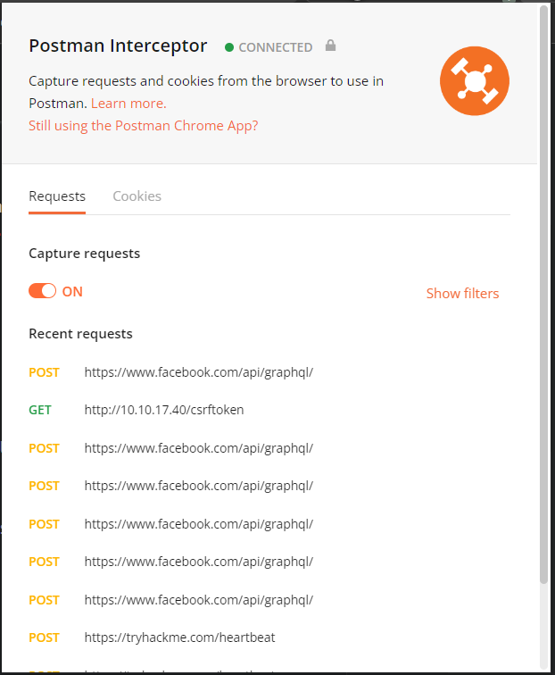

Then we must disable automatic redirect in settings.

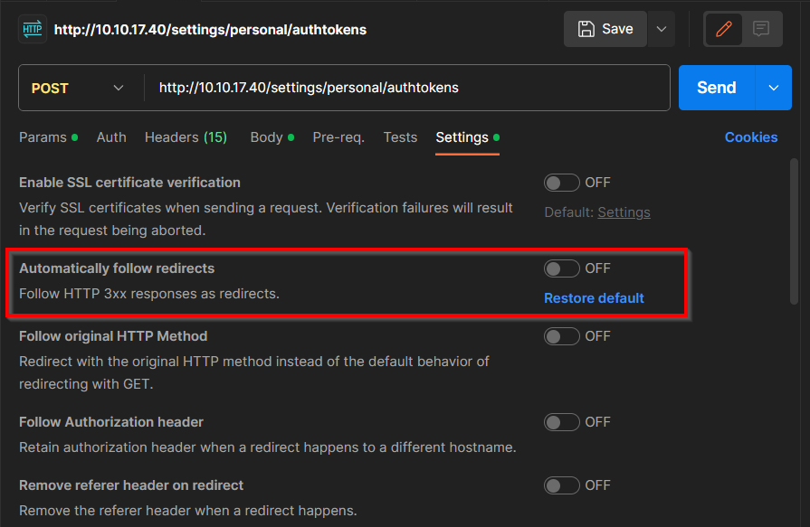

Now we must get Request Token. 

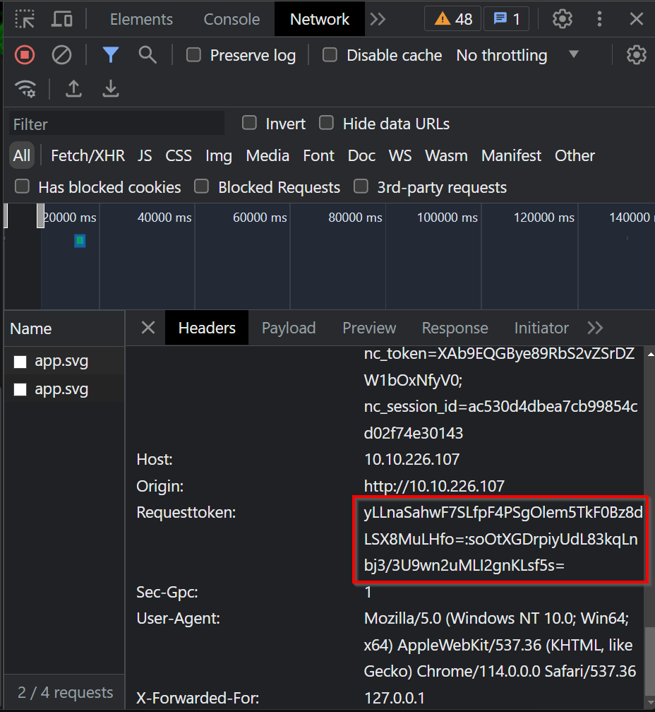

And fill it here.

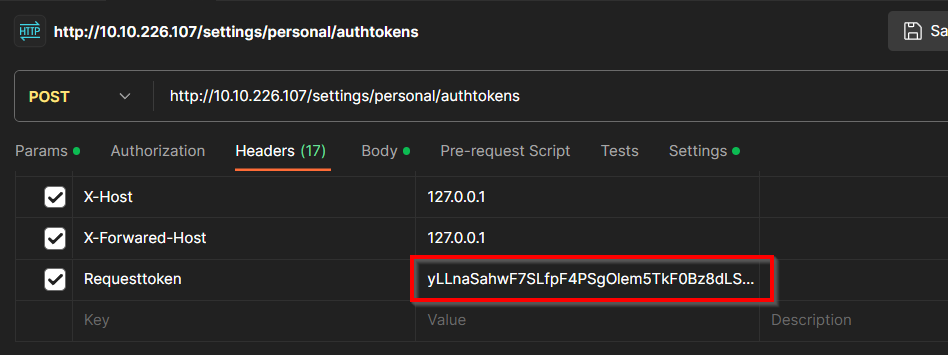

We must also find way to avoid security. We can find it in `www\apps\settings\lib\Controller\AuthSettingsController.php`

We can deduce that loginName must have space on the end. 

Then the request is send, we will get this output.

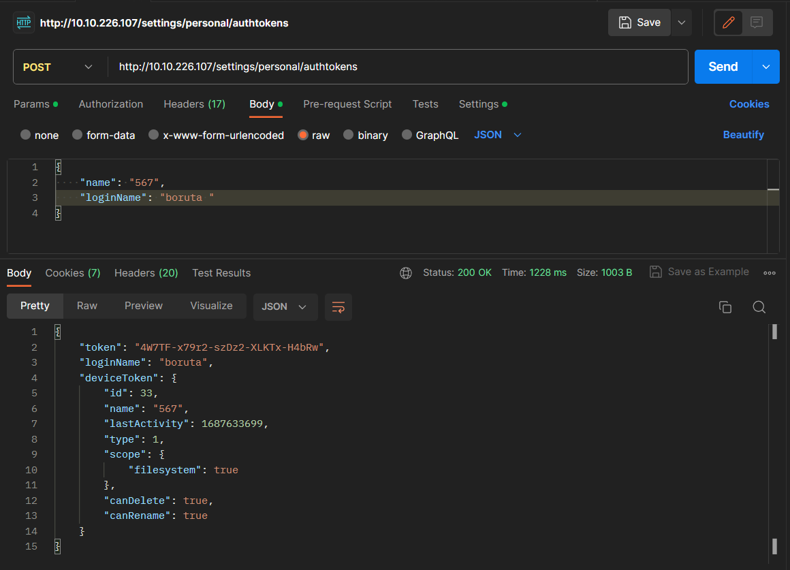

Now we must open Nextcloud program or something another. Fill server ip.

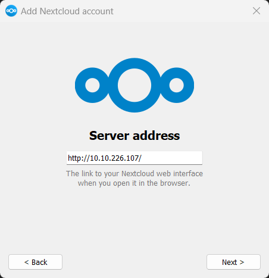

Then we must grant access in browser.

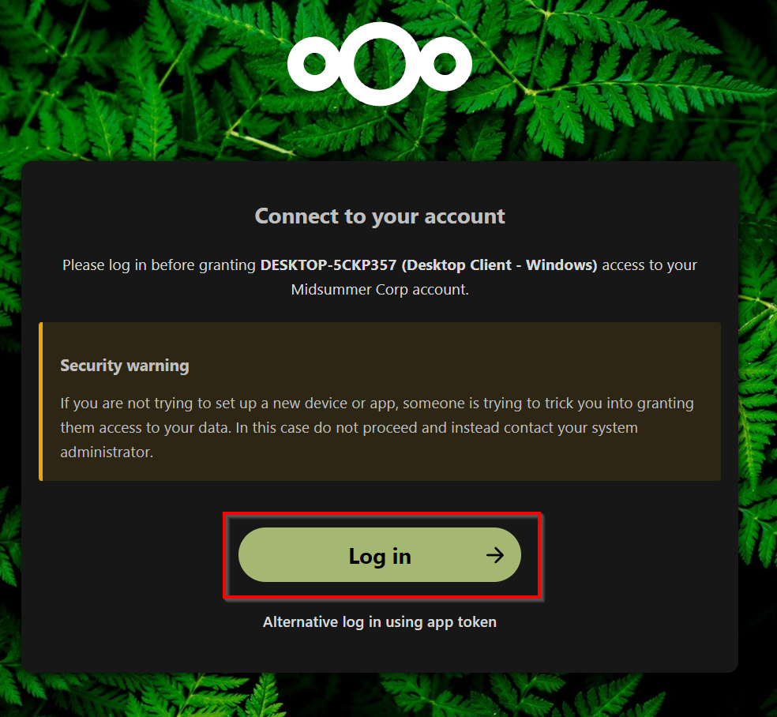 

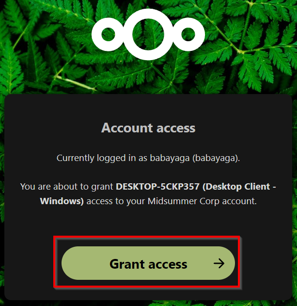 

Then we need to use app now.

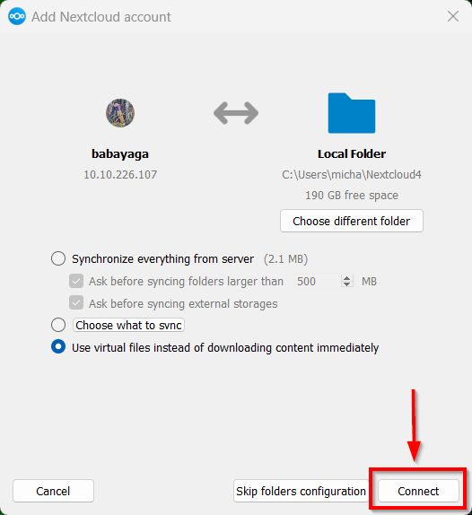 

Then we need to open file explorer.

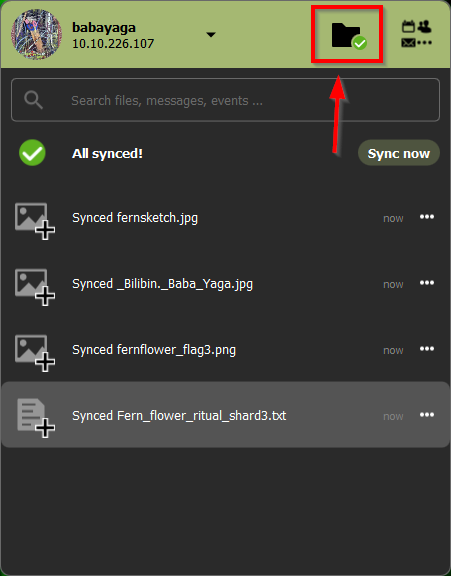 

Here we go. We have file with the answer.

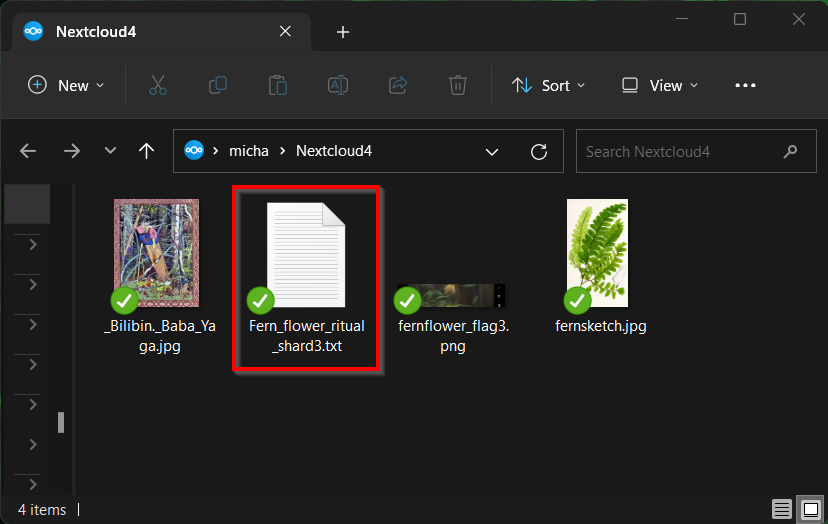 