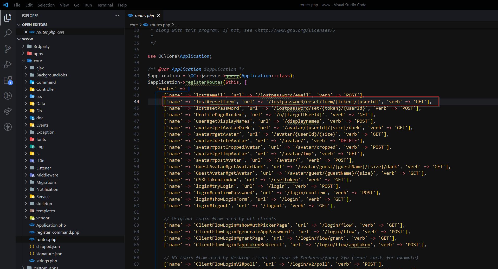

# Task 5
We must download source zip file. Let's extract it. In the "/core/routes.php" file we have all routes listed.

We also must set header which is "X-Forwarded-For". I used for that google extension Mod Header.

